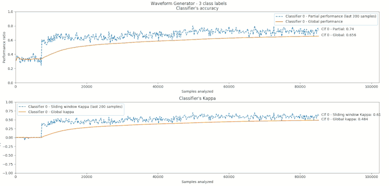

In this tutorial we show how to use *scikit-multiflow*.

## First example.

In this example, we will use a data stream to train a `Hoeffding Tree (VFDT)`
classifier and will measure its performance using prequential evaluation:

1. Create a stream

    The `WaveformGenerator` generates by default instances with 21 numeric
    attributes and 3 targets, based on a random differentiation of some base
    waveforms:

    ``` python
    stream = WaveformGenerator()
    ```

    Before using the stream, we need to *prepare it* by calling
    `prepare_for_use()`:

    ``` python
    stream.prepare_for_use()
    ```

2. Instantiate the Hoeffding Tree classifier

    Use default parameters.

    ``` python
    ht = HoeffdingTree()
    ```

3. Setup the evaluator
    ``` python
    evaluator = EvaluatePrequential(show_plot=True, pretrain_size=200, max_instances=20000)
    ```
    * `show_plot=True` to get a dynamic plot that is updated as the classifier is
    trained.
    * `pretrain_size=200` sets the number of samples passed in the first train
      call.
    * `max_instances=20000` sets the maximum number of samples to use.

4. Run the evaluation

    By calling `evaluate()`, we pass control to the *evaluator*, which will perform
    the following sub-tasks:
    * Check if there are samples in the stream
    * Pass the next sample to the classifier:
      - test the classifier (using `predict()`)
      - update the classifier (using `partial_fit()`)
    * Update the evaluation results and plot

    ``` python
    evaluator.evaluate(stream=stream, model=ht)
    ```

**Putting it all together:**

``` python
from skmultiflow.data.generators.waveform_generator import WaveformGenerator
from skmultiflow.classification.trees.hoeffding_tree import HoeffdingTree
from skmultiflow.evaluation.evaluate_prequential import EvaluatePrequential

# 1. Create a stream
stream = WaveformGenerator()
stream.prepare_for_use()

# 2. Instantiate the HoeffdingTree classifier
ht = HoeffdingTree()

# 3. Setup the evaluator
evaluator = EvaluatePrequential(show_plot=True, pretrain_size=200, max_samples=20000)

# 4. Run evaluation
evaluator.evaluate(stream=stream, model=ht)
```

**Note:** Since we set `show_plot=True`, a new window will be created for the
plot:




## Load data from a file as a stream and save test results into a file.

There are cases where we want to use data stored in files. In this example we
will train the same classifier from the First Example, but this time we will
read the data from a (csv) file and will write the predictions to a (csv) file.

1. Load the data set as a stream

    For this purpose we will use the FileStream class:

    ``` python
    stream = FileStream(filepath, target_idx, n_targets, cat_features_idx)
    ```

    The `FileStream` class will generate a stream using the data contained
    in the file.
    * `filepath`. A string indicating the path where the data file is located.


    Once again, before using the stream, we need to *prepare it* by calling
    `prepare_for_use()`:

    ``` python
    stream.prepare_for_use()
    ```

2. Instantiate the Hoeffding Tree classifier

    Use default parameters.

    ``` python
    ht = HoeffdingTree()
    ```

3. Setup the evaluator

    ``` python
    evaluator = EvaluatePrequential(pretrain_size=1000, max_samples=10000, output_file='results.csv')
    ```

    * `pretrain_size=1000` sets the number of samples passed in the first train
      call.
    * `max_samples=100000` sets the maximum number of samples to use.
    * `output_file='results.csv'` indicates that the results should be stored
     into a file. In this case a file *results.csv* will be created in the
     current path.

4. Run the evaluation

    By calling `eval()`, we pass control to the *evaluator*, which will perform
    the following sub-tasks:
    * Check if there are samples in the stream
    * Pass the next instance to the classifier:
     - test the classifier (using `predict()`)
     - update the classifier (using `partial_fit()`)
    * Write results to `output_file`

When the test finishes, the `results.csv` file will be available in the current
path. The file contains information related to the test that generated the file.
For this example:

```
# TEST CONFIGURATION BEGIN
# File Stream: filename: elec.csv  -  n_targets: 1
# [0] HoeffdingTree: max_byte_size: 33554432 - memory_estimate_period: 1000000 - grace_period: 200 - split_criterion: info_gain - split_confidence: 1e-07 - tie_threshold: 0.05 - binary_split: False - stop_mem_management: False - remove_poor_atts: False - no_pre_prune: False - leaf_prediction: nba - nb_threshold: 0 - nominal_attributes: [] - 
# Prequential Evaluator: n_wait: 200 - max_samples: 10000 - max_time: inf - output_file: results.csv - batch_size: 1 - pretrain_size: 1000 - task_type: classification - show_plot: False - metrics: ['performance', 'kappa']
# TEST CONFIGURATION END
```

Result data in the file includes:
* `id`: the id of the instance that was used for testing
* `global_performance`: overall performance (accuracy)
* `sliding_performance`: sliding window performance (accuracy)
* `global_kappa`: overall kappa statistics
* `sliding_kappa`: sliding window kappa statistics

**Putting it all together:**

``` python
from skmultiflow.data.file_stream import FileStream
from skmultiflow.classification.trees.hoeffding_tree import HoeffdingTree
from skmultiflow.evaluation.evaluate_prequential import EvaluatePrequential

# 1. Create a stream
stream = FileStream("../datasets/elec.csv")
stream.prepare_for_use()

# 2. Instantiate the HoeffdingTree classifier
ht = HoeffdingTree()

# 3. Setup the evaluator
evaluator = EvaluatePrequential(pretrain_size=1000, max_samples=10000, output_file='results.csv')

# 4. Run evaluation
evaluator.evaluate(stream=stream, model=ht)
```
